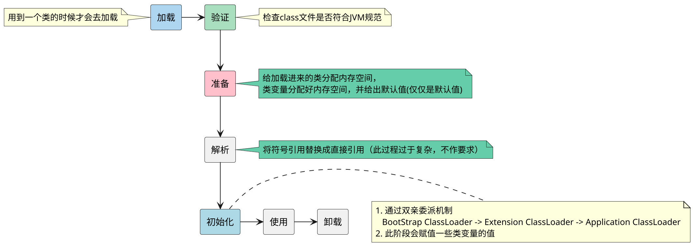

#JVM
# 1. 类加载的过程

# 2. 内存空间区域以及相关的作用

![[Pasted image 20260704160501.png|600]]

在JVM虚拟机规范中，运行时会有5大区域，分别是：==Stack 、Heap、Method Area、Native Area、Program counter register==
针对上面的区域，我们需要了解一下其中各个区域的作用

## 2.1 有哪些是线程共享的？

1. Heap
2. Method Area

## 2.2 Metaspace是啥？ 它和Method Area这些的区别是啥？

`Method Area`只是一个**逻辑概念**，它并不是在物理结构中有这个区域，最终物理实现是通过`Metaspace`来实现的。

在JVM虚拟机规范中，需要`Method Area`来保存类的结构信息等，它并没有规定这块区域应该存放在哪儿，可以是Heap也可以是在本地内存中，同时也没有规定其大小和垃圾回收的策略。

### 2.2.1 定义维度方面的考量

- `Method Area` 是JVM规范中的逻辑概念
- `Metaspace` 是JVM虚拟机具体实现的时候的物理区域和具体实现

### 2.2.2 物理落地与内容的区别

由于JVM规范只是对Method Area进行了规范，Metaspace是具体的实现，但是从性能的考量，现代JVM实现的时候，并非将所有规范中的东西全部放在了Metaspace中。
- **Metaspace只承载了Method Area中的一部分内容（主要是类的版本、字段、方法、接口等类的元数据信息和运行时常量池）**
- 在JVM规范中原本定义的**字符串常量和类的静态变量**，在实现的时候会放在堆里面，并不在Metaspace中

### 2.2.3 JDK7之前的实现逻辑

在JDK7-之前，JVM在实现`Method Area`的时候是用『永久代』在JVM堆内存中实现的，而现在却是用本地内存来实现，这样大小就由物理内存决定。

> [!note] 
>  什么是运行时常量、字符串常量、类的静态变量？
>  1. 运行时常量就是每个类中的final修饰的数据，就是运行时常量
>  2. 字符串常量    String str = "abc"; 这些优先从字符串常量池中寻找，有的话就直接连接使用，没有的话，创建并放入到字符串常量池中
>  3. 类的静态变量  就是类中的static修饰的变量

### 2.2.4 Method Area在什么时候GC？

Method Area发生GC的场景一般来说有点复杂，记住常见的3种情况即可

1. **Metaspace空间达到了『水位线』**
	1. 在JVM启动的时候，可以设置参数`-XX:MetaspaceSize`，这个就是设置的大小容量。
	2. 其实这个水位线是一个动态逻辑，上面只是设置的初始大小，如果多次Full GC后，空间占用很多，会调高这个水位线
2. **由Full GC顺带着进行GC**
3. **当某个类加载器ClassLoader彻底死掉**
	1. **实例死绝** ----> 该类的所有实例对象都已经被GC回收掉
	2. **卸载无门**   -----> 加载该类的ClassLoader被GC
	3. **查无此人**    -----> 该类的class对象(java.lang.Class)没有任何地方引用

## 2.3  Program Counter Register 是啥

PCR是线程独享的，同时也是唯一一个永远不会发生OOM的区域。
记录的是当前程序的指令码执行的位置，如果执行的是native的方法，PCR计数器的值就是undefined

## 2.4 Stack是啥？

每当方法调用的时候都会创建一个栈帧==stack frame== ，然后入栈，在stack frame中存放的是方法的局部变量表、操作数栈、方法出口等信息

Stack的区域会发生OOM，同时也会发生StackOverFlow的错误和异常。

*什么情况下会发生OOM？什么情况在会发生stackOverFlowError？*
- **OOM**  ---->  本质上是因为JVM栈允许动态拓展，当拓展无法申请足够内存的时候；或者新建线程，没有足够的内存空间来分配当前的线程虚拟机栈
	- ==最常见的就是疯狂的创建线程，而不是使用线程池==
- **StackOverflowError** ----> 就是在Stack Frame的时候进行了套娃式的创建新的Stack Frame，最后导致Stack的空间被压爆
	- ==最常见的方法的循环调用，最后死循环没有终止出来；递归嵌套的逻辑很大也可能出现此情况==

# 3. JVM的分代模型

JVM中的分代概念是为了在Heap中进行一个区域，用于管理存活或者垃圾回收的区域。

- **年轻代**    生存周期小的对象所存放的区域。  此区域一般采用**复制算法**进行GC，GC频率高
- **老年代**  生存周期大的对象所存放的区域。  此区域一般采用**标记清除 或者 标记-清除-整理**算法进行GC，GC频率低
- ~~永久代~~    这个在JDK7之前是Method Area的物理实现的区域，但是在JDK8过后已经去除此区域了，统一用Metasapce进行管理

