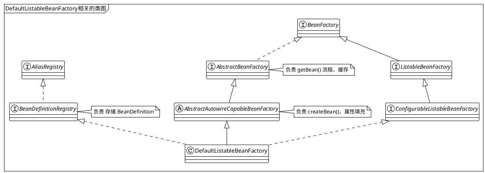
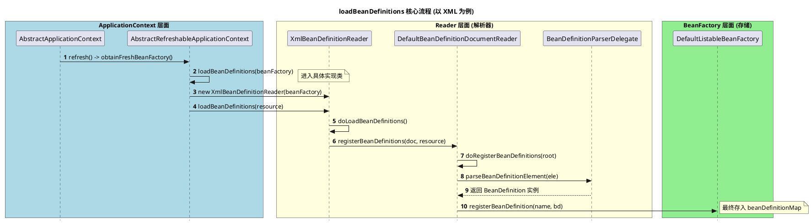

# 1. 什么是Spring IOC

Spring IOC是整个Spring中最核心的概念。 ==IOC = Inversion of Control==  控制反转

原理：
> [!note]
> 将原本由开发者手动`new`对象、管理依赖的权力，移交给Spring Container处理，通过**反射机制** + **配置信息**，实现对象的自动创建、装配和生命周期管理。


传统的方式，需要`new`，而且类和类之间严重耦合，如果要改一个类，那么依赖的那个类可能也需要调整。
但是Ioc可以很好的解决这个问题，如果A依赖了B，Spring会自动创建B，并将其『注入』给A。这就是DI(依赖注入)。

理解IoC的核心组件
1. **BeanDefinition** ----- 蓝图。 Spring不直接操作类，而是将类的信息（类名、作用域、是否懒加载、依赖关系等）抽象成`BeanDefinition`。
2. **BeanFactory**----- 工厂。Spring容器的核心，它是一个智能工厂，根据`BeanDefinition`这个图纸生产Bean。
3. **BeanDefinitionReader**------ 翻译官。 负责读取XML、注解（比如@Service @Component）或者配置类（@Configuration），将他们转换成容器能够理解的`BeanDefinition`。




以上的类中， `AliasRegistry` 和`ConfigurableBeanFactory`是辅助类，可以知道一个大概就OK
- `AliasRegistry`  负责管理Bean的别名。逻辑很简单，就是一个Map存储别名映射，不影响核心流程。
- `ConfigurableBeanFactory`  定义了一些配置方法，比如配置类加载器等，在启动阶段有用，但是不影响理解IoC原理。

<span class='b' style='font-size:23px'>核心的核心</span>

- `BeanFactory` 
	- 这个是整个spring的根源，需要记住`getBean()`方法。他说所有容器的始祖。
- `AbstractBeanFactory`  
	- **极其重要** 。它是所有`BeanFactory`实现的基类。
	- 核心点：它实现了`getBean()`的主流程，包括著名的三级缓存逻辑，合并BeanDefinition的逻辑，都在里面。
- `AbstractAutowireCapableBeanFactory`      
	- 这个是一个抽象类，可以理解为Bean生命周期的『产房』。
	- 核心点：它实现了`createBean()`和`doCreateBean()`等方法。Bean的实例化、属性填充、依赖注入、初始化回调全部在这里完成。如果想看Bean是怎么new出来的，可以到这里面。

<span class='b' style='font-size:23px'>骨架级</span>

- `BeanDifinitionRegistry` 
	- 专门负责『存图纸』。它定义了`registryBeanDifinition()`方法，没有它就不知道该生产什么
- `ConfigurableListableBeanFactory`
	- 这个是一个集大成的接口，他把『配置功能』、『列举能力』、『自动装配的能力』都整合到一起。`DefaultListableBeanFactory`就是它的直接实现者
- `ListableBeanFactory`
	- 增加获取『批量』的能力，`getBeanOfType()` 按照类型找出一堆Bean

# 2.  如何开始第一个bean呢？

其实在spring4.x的版本中，我们学习的时候都是用`XmlBeanFactory`作为基础容器然后开始讲，但是现在spring过渡到5.x甚至6.x版本后，已经移除了`XmlBeanFactory`，因为它不符合Spring的单一原则，它将容器和XML进行了强绑定，所以被删除了。
所以我们打算用一个新的方式进行创建我们的第一个Bean

- 先创建一个普通的class，这个就忽略了
- 创建一个`beans.xml`，放在`resources`目录下

```xml
<?xml version="1.0" encoding="UTF-8"?>
<beans xmlns="http://www.springframework.org/schema/beans"
       xmlns:xsi="http://www.w3.org/2001/XMLSchema-instance"
       xsi:schemaLocation="http://www.springframework.org/schema/beans
                           http://www.springframework.org/schema/beans/spring-beans.xsd">
    <!-- 定义一个 MyBean -->
    <bean id="myBean" class="com.zmglove.eurekeserverdemo.learn.MyBean">
    </bean>
</beans>
```

- 创建一个test类

```java
public class TestBeanTest {
    @Test
    public void test(){
        BeanFactory bf = new ClassPathXmlApplicationContext("beans.xml");
        MyBean mb = bf.getBean("myBean", MyBean.class);
        Assert.isTrue("hello".equals( mb.getStr()),"数据不匹配");
    }
}
```

OK，那么我们就从`ClassPathXmlApplicationContext`开始入手啦。

通过以上的代码来看，逻辑非常简单，但是核心流程却是异常复杂，所以应该拆分相关的逻辑，从点到面开始深入。

## 2.1 spring是如何读取xml配置然后转为BeanDefinition的呢？

我们先忽略最重要的`AbstractApplication`中的`refresh()`入口开始，我们只需要知道是在`refresh()`方法中，
```java
// Tell the subclass to refresh the internal bean factory.
ConfigurableListableBeanFactory beanFactory = obtainFreshBeanFactory();
```
在这一步是获取`BeanFactory`开始的，好，我们进入这个方法内部瞧一瞧。



细节中，关于如果解析XML中的标签信息的逻辑，其实在spring源码中不是最主要的，我们只需要知道最终xml -> BeanDefinition

- `XmlBeanDefinitionReader` 中具体会处理`loadBeanDefinitions(Resource)`。

在方法`loadBeanDefinitions`中去调用`BeanDefinitionDocumentReader`的方法`registerBeanDefinitions`
这个就是最终的处理逻辑

1. 获得一个`BeanDefinitionParserDelegate` 这个是处理BeanDefinition的解析器，干一些解析的脏活
2. 进行解析元素，最终调用内部的一个方法`parseBeanDefinitions()` --->  `parseDefaultElement(ele, delegate)` 这个是处理默认标签的，自定义标签里面同样也有，不赘述了。 
3. 最终，会执行到`BeanDefinitionReaderUtils.registerBeanDefinition(bdHolder, getReaderContext().getRegistry());`
4. 至此，loadBeanDefinition的流程完毕。

✅✅追问一下，最终处理的*registry*这个对象实例是谁？ 是`DefaultListableBeanFactory`，所以一再强调，这个类非常重要。

```java title=DefaultListableBeanFactory.java
public void registerBeanDefinition(String beanName, BeanDefinition beanDefinition){}
```

把BeanDefinition的信息，存放到`beanDefinitionMap` 中。

> [!danger]
> 补充2点，在执行完`beanDefinitionMap.put()`方法之后，Spring还有两个非常重要的小事
> 1. **更新beanDefinitionNames**  ：把`beanName`存放到`ArrayList`中，因为Map是无序的，用list可以保证Bean的注册先后顺序，方便后续按照顺序来初始化
> 2. **重置缓存**：如果一个已经存在的Bean，需要清理掉，然后重新获取新的BeanDefinition的信息才行


## 2.2 spring的bean加载都是从调用getBean开始的吗？

答案是 ： 取决于是『预初始化』和『懒加载』

**情况A:**
绝大数情况下，Bean都是单例的，所以在容器启动的时候，就会调用`refresh`过程，这个过程中，Spring为了提高响应速度，会在容器启动的最后阶段，主动地把所有『非懒加载』的单例bean全部创建好。

**情况B:**
针对那些懒加载的Bean或者多例的Bean，只有在第一次调用`getBean`时开始加载。

但是不管怎么说，所有的bean最终的创建都是在`getBean()`方法中实现的。

那么，为什么spring默认在启动的时候就加载呢？
1. 尽早发现问题：比如bean的配置错误，在启动的时候就能报错，而不是运行时报错
2. 性能优化：很多都是单例的bean，启动耗时一点，但是换来的时候运行时的获取快速
3. 线程安全：启动的时候是单线程环境，避免一些复杂的问题

## 2.3 我们一直说的上下文，到底是个什么东西？

一个公式：
$$上下文 = BeanFactory + 各种服务能力(翻译、广播、资源定位等)$$

其实就是一些环境变量、属性文件检查以及一些配置信息等，统一的放在了上下文中，在后续的处理中直接读取即可。

# 3. AbstractApplicationContext的refresh()方法详解

在Spring容器启动的时候，一定会走到`AbstractApplicationContext`的`refresh()`方法，这个是Spring容器学习最重要的地方，整个`refresh()`方法内部主要有==**12**==个步骤

| 序号         | 方法名                                 | 核心作用                                                                                            |
| ---------- | ----------------------------------- | ----------------------------------------------------------------------------------------------- |
| 1          | `prepareRefresh()`                  | **启动前的准备**，初始化开关状态、记录启动时间、校验环境变量以及系统环境数据等                                                       |
| 2 ‼️‼️     | `obtainFreshBeanFactory()`          | **创建工厂 + 加载BeanDefinitions** 告诉底层`BeanFactory`加载XML或者注解，解析成`BeanDefinition`，执行完这一步，图纸就已经存在Map中了 |
| 3          | `prepareBeanFactory()`              | **工厂功能增强** 给工厂注册类加载器，设置忽略的接口、注册一些标准Bean (比如Environment)                                         |
| 4          | `postProcessBeanFactory()`          | **子类拓展点** 留给具体子类去修改工厂的额外设置信息，子类可以重写这个方法，对BeanFactory里面的信息做修改                                    |
| 5‼️‼️‼️    | `invokeBeanFactoryPostProcessors()` | **执行工厂处理器----这个是核心点** 在这里面会解析`@Configuration` `@Service`等注解类扫描转为BeanDefinitions信息               |
| 6❗️❗️      | `registryBeanPostProcessors()`      | **注册拦截器**  把实现了`BeanPostProcessor`的类找出来并进行注册，它是AOP代理实现的基石                                       |
| 7          | `initMessageSource()`               | **初始化国际化**                                                                                      |
| 8          | `initApplicationEventMulticaster()` | **初始化事件广播** 创建一个管理事件的中心，以后发布事件`Event`全靠它                                                        |
| 9          | `onRefresh()`                       | **特殊初始化** : 典型的钩子函数，SpringBoot会在这里启动内嵌的Tomcat                                                   |
| 10         | `registerListeners()`               | **注册事件监听器**  把所有写好的`ApplicationListener`注册到上面的广播站里面                                             |
| 11‼️‼️‼️‼️ | `finishBeanFactoryInitialization()` | **核心：实例化Bean**  这个是最重要的一步，遍历所有非懒加载单例，完成`getBean()`、实例化、DI以及初始化                                  |
| 12         | `finishRefresh()`                   | **鸣枪收工**  发布容器刷新完成事件，同时清理临时缓存                                                                   |

以上是`AbstractApplication`中`refresh()`方法的流程，其中最重要的是第2、5、6、11步。
其中第二步的流程，我们在上面关于`BeanDefinition`的流程已经讲过了，此处就赘述了，接下来我们重点讲一下5、6、11。

# 4. refresh()中的第5步invokeBeanFactoryPostProcessors()讲解

此处，需要明白一点，在第2步`obtainFreshBeanFactory()`方法中也会进行部分Bean的BeanDefinition的加载，那么，它究竟加载了哪些Bean呢?

**情况A**
基于XML启动的，使用`ClassPathXmlApplicationContext("beans.xml")`这种类型的，加载的内容就是xml里面定义的bean信息，不包括其他的
**情况B**
基于注解启动`AnnotationConfigApplicationContext(AppConfig.class)`或者`springBoot的run()`
加载内容：
1. 传入的配置类本身，比如`AppConfig`类 或者`@SpringBootApplication`启动类
2. Spring内置的基础设施Bean，主要是为了方便后续解析注解，Spring预先注册几个核心的『包工头』Bean
	1. `ConfigurationClassPostProcessor`  极其重要，它是第5步的主角
	2. `AutowireAnnotationBeanPostProcessor`  负责处理`@Autowired`
	3. `CommonAnnotationBeanPostProcessor` 负责`@Resource`

所以在第二步过后，BeanDefinitionMap中只会有上述少量的Bean信息，那些我们常见的Service Bean 等都还没有加载，等到第5步的时候去处理。

OK，那我们开始`invokeBeanFactoryPostProcessor()`方法的逻辑。
一言以蔽之：**在Bean还没有实例化之前，最后一次修改或者增加『BeanDefinition』**
核心的代码：
```java
protected void invokeBeanFactoryPostProcessors(ConfigurableListableBeanFactory beanFactory) {
	// 这个才是最核心的代码
	PostProcessorRegistrationDelegate.invokeBeanFactoryPostProcessors(beanFactory, getBeanFactoryPostProcessors());
	// .... 还有一段，但是不重要
	}
```

拆开来看，首先，`getBeanFactoryPostProcessors()`这个方法是干啥的？它获取哪些BeanFactoryPostProcessor？
主要是手动注册进ApplicationContext的`BeanFactoryPostProcessor`或者`BeanDefinitionRegistryPostProcessor`
当然，也有可能是spring容器本身主动添加的一些processor，典型代表就是`ConfigurationClassPostProcessor`
他们不是通过扫描`BeanDefinition`创建的这些。

这个方法内部，有两大处理器
- `BeanDefinitionRegistryPostProcessor`  简称**BDRPP**，增删BeanDefinition，可以向容器注册新的Bean，优先级最高，优先执行
- `BeanFactoryPostProcessor` 简称**BFPP** 用于修改BeanDefinition，比如修改已存在的Bean的属性等，后执行

![[Pasted image 20260122160826.png|500]]
 


AOP的流程以及在refresh中的哪一步处理的