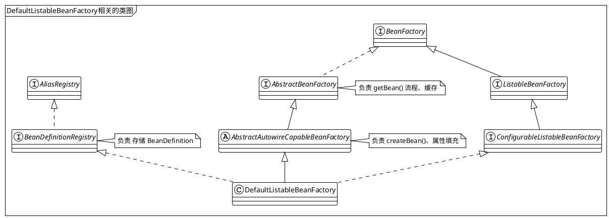
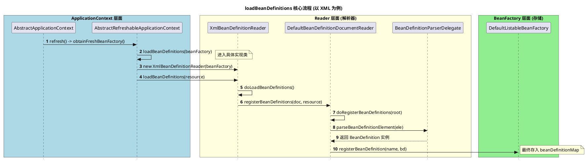

# 1. 什么是Spring IOC

Spring IOC是整个Spring中最核心的概念。 ==IOC = Inversion of Control==  控制反转

原理：
> [!note]
> 将原本由开发者手动`new`对象、管理依赖的权力，移交给Spring Container处理，通过**反射机制** + **配置信息**，实现对象的自动创建、装配和生命周期管理。


传统的方式，需要`new`，而且类和类之间严重耦合，如果要改一个类，那么依赖的那个类可能也需要调整。
但是Ioc可以很好的解决这个问题，如果A依赖了B，Spring会自动创建B，并将其『注入』给A。这就是DI(依赖注入)。

理解IoC的核心组件
1. **BeanDefinition** ----- 蓝图。 Spring不直接操作类，而是将类的信息（类名、作用域、是否懒加载、依赖关系等）抽象成`BeanDefinition`。
2. **BeanFactory**----- 工厂。Spring容器的核心，它是一个智能工厂，根据`BeanDefinition`这个图纸生产Bean。
3. **BeanDefinitionReader**------ 翻译官。 负责读取XML、注解（比如@Service @Component）或者配置类（@Configuration），将他们转换成容器能够理解的`BeanDefinition`。




以上的类中， `AliasRegistry` 和`ConfigurableBeanFactory`是辅助类，可以知道一个大概就OK
- `AliasRegistry`  负责管理Bean的别名。逻辑很简单，就是一个Map存储别名映射，不影响核心流程。
- `ConfigurableBeanFactory`  定义了一些配置方法，比如配置类加载器等，在启动阶段有用，但是不影响理解IoC原理。

<span class='b' style='font-size:23px'>核心的核心</span>

- `BeanFactory` 
	- 这个是整个spring的根源，需要记住`getBean()`方法。他说所有容器的始祖。
- `AbstractBeanFactory`  
	- **极其重要** 。它是所有`BeanFactory`实现的基类。
	- 核心点：它实现了`getBean()`的主流程，包括著名的三级缓存逻辑，合并BeanDefinition的逻辑，都在里面。
- `AbstractAutowireCapableBeanFactory`      
	- 这个是一个抽象类，可以理解为Bean生命周期的『产房』。
	- 核心点：它实现了`createBean()`和`doCreateBean()`等方法。Bean的实例化、属性填充、依赖注入、初始化回调全部在这里完成。如果想看Bean是怎么new出来的，可以到这里面。

<span class='b' style='font-size:23px'>骨架级</span>

- `BeanDifinitionRegistry` 
	- 专门负责『存图纸』。它定义了`registryBeanDifinition()`方法，没有它就不知道该生产什么
- `ConfigurableListableBeanFactory`
	- 这个是一个集大成的接口，他把『配置功能』、『列举能力』、『自动装配的能力』都整合到一起。`DefaultListableBeanFactory`就是它的直接实现者
- `ListableBeanFactory`
	- 增加获取『批量』的能力，`getBeanOfType()` 按照类型找出一堆Bean

# 2.  如何开始第一个bean呢？

其实在spring4.x的版本中，我们学习的时候都是用`XmlBeanFactory`作为基础容器然后开始讲，但是现在spring过渡到5.x甚至6.x版本后，已经移除了`XmlBeanFactory`，因为它不符合Spring的单一原则，它将容器和XML进行了强绑定，所以被删除了。
所以我们打算用一个新的方式进行创建我们的第一个Bean

- 先创建一个普通的class，这个就忽略了
- 创建一个`beans.xml`，放在`resources`目录下

```xml
<?xml version="1.0" encoding="UTF-8"?>
<beans xmlns="http://www.springframework.org/schema/beans"
       xmlns:xsi="http://www.w3.org/2001/XMLSchema-instance"
       xsi:schemaLocation="http://www.springframework.org/schema/beans
                           http://www.springframework.org/schema/beans/spring-beans.xsd">
    <!-- 定义一个 MyBean -->
    <bean id="myBean" class="com.zmglove.eurekeserverdemo.learn.MyBean">
    </bean>
</beans>
```

- 创建一个test类

```java
public class TestBeanTest {
    @Test
    public void test(){
        BeanFactory bf = new ClassPathXmlApplicationContext("beans.xml");
        MyBean mb = bf.getBean("myBean", MyBean.class);
        Assert.isTrue("hello".equals( mb.getStr()),"数据不匹配");
    }
}
```

OK，那么我们就从`ClassPathXmlApplicationContext`开始入手啦。

通过以上的代码来看，逻辑非常简单，但是核心流程却是异常复杂，所以应该拆分相关的逻辑，从点到面开始深入。

## 2.1 spring是如何读取xml配置然后转为BeanDefinition的呢？

我们先忽略最重要的`AbstractApplication`中的`refresh()`入口开始，我们只需要知道是在`refresh()`方法中，
```java
// Tell the subclass to refresh the internal bean factory.
ConfigurableListableBeanFactory beanFactory = obtainFreshBeanFactory();
```
在这一步是获取`BeanFactory`开始的，好，我们进入这个方法内部瞧一瞧。



细节中，关于如果解析XML中的标签信息的逻辑，其实在spring源码中不是最主要的，我们只需要知道最终xml -> BeanDefinition

- `XmlBeanDefinitionReader` 中具体会处理`loadBeanDefinitions(Resource)`。

在方法`loadBeanDefinitions`中去调用`BeanDefinitionDocumentReader`的方法`registerBeanDefinitions`
这个就是最终的处理逻辑

1. 获得一个`BeanDefinitionParserDelegate` 这个是处理BeanDefinition的解析器，干一些解析的脏活
2. 进行解析元素，最终调用内部的一个方法`parseBeanDefinitions()` --->  `parseDefaultElement(ele, delegate)` 这个是处理默认标签的，自定义标签里面同样也有，不赘述了。 
3. 最终，会执行到`BeanDefinitionReaderUtils.registerBeanDefinition(bdHolder, getReaderContext().getRegistry());`
4. 至此，loadBeanDefinition的流程完毕。

追问一下，最终处理的registry这个对象实例是谁？ 是`DefaultListableBeanFactory`。  所以一再强调，这个类非常重要。

```java title=DefaultListableBeanFactory.java
public void registerBeanDefinition(String beanName, BeanDefinition beanDefinition){}
```
把BeanDefinition的信息，存放到`beanDefinitionMap` 中